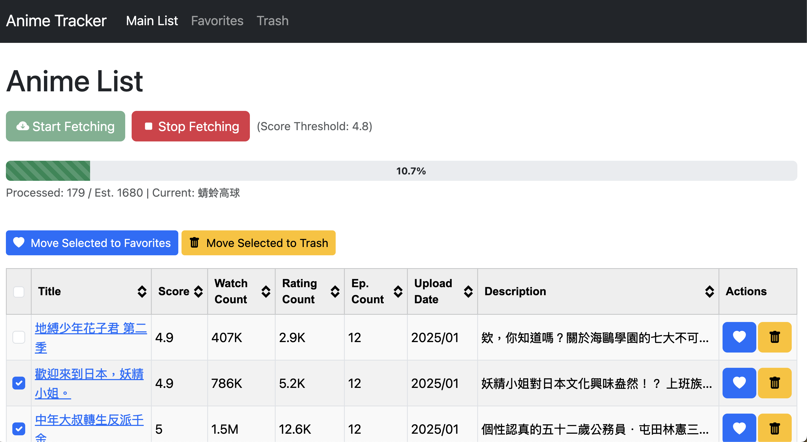

# High Score Anime Fetcher

A Flask-based web application to fetch and track high-scoring anime from <https://ani.gamer.com.tw>. It provides a simple web interface to view filtered anime, manage favorites and trash lists, and caches data locally to optimize fetching.



**Note on Code Origin:**

Much of the code in this repository was generated with assistance from Google Gemini 2.5 Pro. While functional for its purpose as a local tool, it may not reflect all conventional coding practices or the maintainer's preferred style. It is shared 'as-is' for community utility.

## Features

* **Data Fetching:** Scrapes anime titles, scores, descriptions, episode counts, watch counts, rating counts, and upload dates from <https://ani.gamer.com.tw>.
* **Smart Caching:** Caches *all* encountered anime details locally in `anime_data.json`. Only re-fetches details if episode count increases or watch count significantly increases (more than doubles), speeding up subsequent runs.
* **Configurable Filtering:** Filters the main display list based on minimum score (default: >= 4.8) and minimum episode count (default: >= 10). Filtering parameters are easily adjustable in `server.py`.
* **Web Interface:** Clean and responsive UI built with Flask and Bootstrap 5.
* **Background Processing:** Fetches data in a background thread, allowing the UI to remain responsive.
* **Real-time Progress:** Uses Server-Sent Events (SSE) to display scraping progress (percentage, items loaded, current status) without needing page refreshes.
* **List Management:** Organize anime into "Favorites" and "Trash" lists.
* **Batch Actions:** Select multiple anime using checkboxes to move them between lists (Main <-> Favorites <-> Trash) in bulk.
* **Table Sorting:** Click table headers on any list to sort data.
* **Human-Readable Numbers:** Displays large watch/rating counts in a compact format (e.g., 1.2M, 5.6K).

## Technology Stack

* **Backend:** Python 3, Flask
* **HTTP Requests:** Requests
* **HTML Parsing:** Beautiful Soup 4
* **Frontend:** Bootstrap 5, jQuery, Tablesorter (jQuery Plugin)
* **Data Storage:** JSON

## Prerequisites

* Python 3 (Recommended: 3.7+)
* `pip` (Python package installer, usually included with Python)
* Git (for cloning the repository)
* A modern web browser

## Setup and Installation

1. **Clone the Repository:**

    ```bash
    git clone https://github.com/Timmatt-Lee/high-score-ani-fetcher.git
    cd high-score-ani-fetcher
    ```

2. **Create a Virtual Environment (Recommended):**
    * On macOS/Linux:

        ```bash
        python3 -m venv .venv
        source .venv/bin/activate
        ```

    * On Windows:

        ```bash
        python -m venv .venv
        .\.venv\Scripts\activate
        ```

3. **Install Dependencies:**

    ```bash
    pip install -r requirements.txt
    ```

## Running the Application

1. **Start the Flask Server:**

    ```bash
    python server.py
    ```

2. **Access the Web UI:** Open your web browser and navigate to:
    <http://127.0.0.1:5002/> (or the address shown in the terminal).

## Usage

1. **Fetching Data:** Click the "Start Fetching" button on the main page. The application will start scraping <https://ani.gamer.com.tw> in the background.
2. **Monitoring Progress:** Observe the progress bar and status messages below the control buttons. New or updated anime meeting the filter criteria (Score \>= 4.8, Episodes \>= 10 by default) will appear in the table dynamically.
3. **Viewing Lists:** Use the navigation bar at the top to switch between the "Main List", "Favorites", and "Trash" pages.
4. **Sorting:** Click on sortable table headers (like Score, Watch Count) to sort the data.
5. **Single Item Actions:** Use the icon buttons (<i class="bi bi-heart-fill"></i>, <i class="bi bi-trash-fill"></i>, etc.) in each table row to move individual anime between lists.
6. **Batch Actions:**
      * Check the checkboxes next to the anime titles you want to act on.
      * Use the "Select All" checkbox in the header for convenience.
      * Click the batch action buttons (e.g., "Move Selected to Favorites", "Move Selected to Trash") located above the table.
7. **Stopping:** Click "Stop Fetching" to gracefully request the background scraping task to halt after its current step.

## Data Storage

All application data, including the main filtered list, favorites, trash, and the complete anime cache, is stored in a single JSON file named `anime_data.json`. This file is created automatically in the same directory as `server.py` when you first run the application if it doesn't exist.

## Configuration

You can adjust some behavior by modifying the constants and configuration dictionary near the top of the `server.py` file:

* `SCORE_THRESHOLD`: Minimum score for an anime to appear on the main list.
* `EPISODE_THRESHOLD`: Minimum episode count for an anime to appear on the main list.
* `SCRAPE_PAGE_DELAY_MIN`/`MAX`: Wait time between fetching list pages.
* `SCRAPE_DETAIL_DELAY_MIN`/`MAX`: Wait time between fetching detail pages.
* `SCRAPE_RETRY_COUNT`: Number of retries for failed HTTP requests.

## Disclaimer

* This tool is intended for personal and educational use only.
* **Be Responsible:** Avoid running fetches too frequently or aggressively, as this could put an unnecessary load on <https://ani.gamer.com.tw>. Respect the website's resources.
* **Terms of Service:** You are responsible for ensuring your use of this script complies with the terms of service of <https://ani.gamer.com.tw>.
* **Website Changes:** Web scraping relies on the structure of the target website. If <https://ani.gamer.com.tw> changes its layout, this scraper may break and require updates.

## Contributing

Contributions, issues, and feature requests are welcome\! Feel free to check [issues page](https://github.com/Timmatt-Lee/high-score-ani-fetcher/issues).

## License

This project is licensed under the MIT License - see the [LICENSE](LICENSE) file for details.
